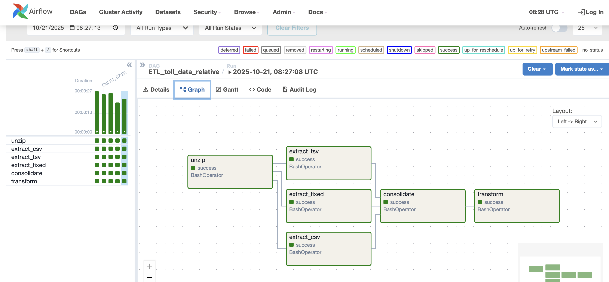
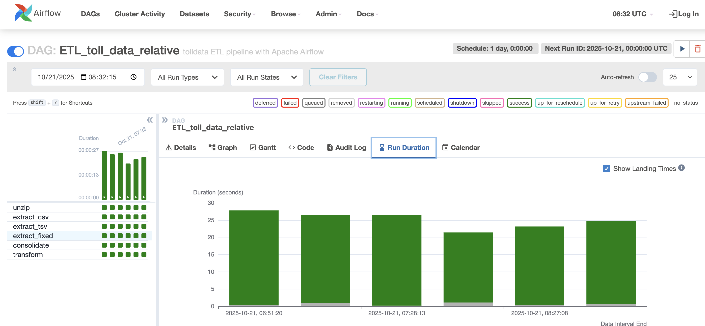

# Toll Plaza Data ETL Pipeline with Apache Airflow

This project implements an Apache Airflow-based ETL pipeline that automates the extraction, transformation, and loading of toll plaza data. 

The DAG is built to run on a *CeleryExecutor*, showcasing distributed task execution for scalability and reliability.

## DAG Overview

Below are sample screenshots from the Airflow UI, demonstrating the pipeline’s structure and performance.

<div align="center">
  
  
</div>

## Folder Structure & Setup Notes

>
>```
> toll-plaza-data-etl/
> ├── data
>│   └── tolldata.tgz
> ├── LICENSE
> ├── README.md
> ├── screenshots
> │   ├── DAG_graph.png
> │   └── DGA_run_duration.png
> └── toll_plaza_etl.py
> ```
>

> ### important:

Place toll_plaza_etl.py inside your Airflow DAG folder before triggering the workflow:

> ```
> $ cp toll_plaza_etl.py ~/airflow/dags/
> ```

This ensures Airflow resolves the relative path:

> ```
> ./data/tolldata.tgz
> ```

## Why CeleryExecutor

This project runs on CeleryExecutor rather than the default SequentialExecutor.
Celery leverages parallel task execution across multiple machines. The performance is more efficient than running the DAG on a LocalExecutor.
